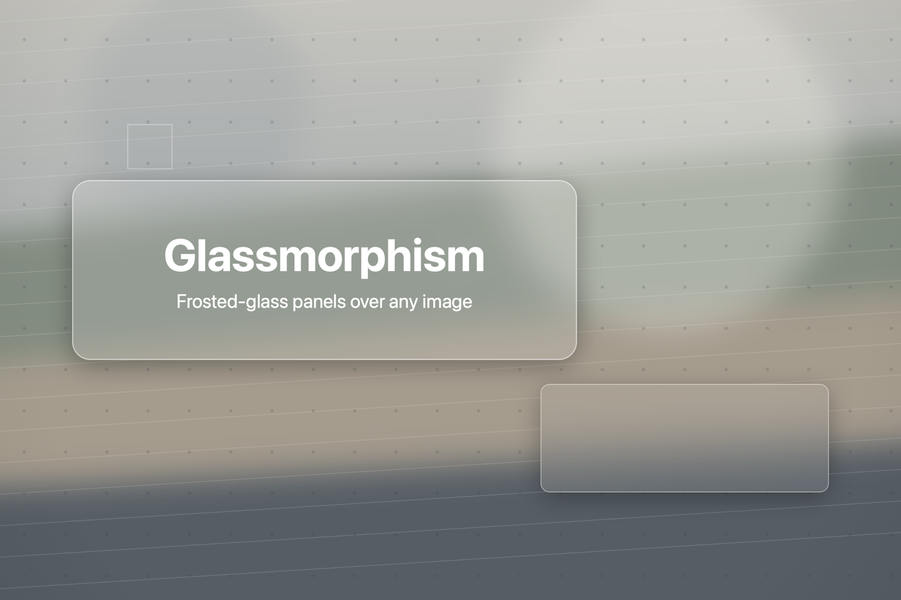

# Glassmorphism

**English** · [繁體中文](README.zh-Hant.md) · [简体中文](README.zh-Hans.md)

A small macOS app for laying frosted-glass panels over an image. Drop in a picture,
drag out as many glass panels as you like, tune every parameter with sliders, and
export at the **original resolution**.



## Features

- **Collage layers.** Drop in more images to arrange over the base — rotate them (with
  magnetic right angles), scale them, give them a shadow or make them semi-transparent.
- **Multiple panels.** Each panel carries its own style and text, independent of the others.
- **Matches the image's own corners.** If the image itself has rounded corners — a window
  screenshot, say — the radius is measured and used as the panel default.
- **Finds the real content.** A macOS window capture carries a transparent margin and a
  drop shadow around the window; panels snap to the window's edges, not the margin's.
- **Everything is a slider.** Blur radius, tint colour and opacity, corner radius, border,
  noise grain, drop shadow.
- **Text on the glass.** Title and subtitle, with font, size, colour and alignment.
- **True WYSIWYG.** The preview and the exported file run through the same renderer, so
  what you see is what you get — just at a different resolution.
- **Export at full resolution**, or copy straight to the clipboard.
- **Three languages**: English, 简体中文, 繁體中文 — switchable from the Language menu.

## Install

Download the latest zip from the [Releases page](../../releases), unpack it, and move
`Glassmorphism.app` to `/Applications`.

The app is ad-hoc signed and **not notarized** (that needs a paid Apple Developer
account), so macOS blocks it on first launch. Either right-click the app and choose
**Open**, or clear the quarantine flag:

```bash
xattr -dr com.apple.quarantine /Applications/Glassmorphism.app
```

Universal binary (Apple silicon + Intel). Requires macOS 13 or later.

## Build from source

Only the Command Line Tools are needed — a full Xcode install is not required.

```bash
./build.sh                  # build for this machine → dist/Glassmorphism.app
open dist/Glassmorphism.app

./release.sh 1.0.0          # universal binary + zip + checksum, ready to upload
```

`swift run` also works for quick iteration.

## Usage

| Action | How |
|---|---|
| Load the base image | Press ⌘O, or open a file with the app |
| Add a collage image | Drop it on the window, or press ⇧⌘O |
| Rotate a collage image | Drag the handle above it (⌥ disables angle snapping) |
| Scale a collage image | Drag any corner — always proportional, from the centre |
| Select a panel | Click it on the canvas, or pick it from the list |
| Move a panel | Drag it |
| Resize a panel | Drag any of the 8 handles |
| Temporarily disable snapping | Hold ⌥ while dragging |
| New panel | ⌘N |
| Duplicate panel | ⌘D |
| Delete panel | ⌘⌫ |
| Change stacking order | ⌘] forward, ⌘[ backward |
| Export PNG | ⌘S (original resolution) |
| Copy | ⇧⌘C (original resolution) |

Unselected panels are outlined with a dashed white border; the selected one gets a solid
outline and 8 handles.

Moving and resizing both snap to the image's edges and centre lines, and to the edges and
centre lines of the other panels and collage images. A magenta guide marks whatever the panel has locked
onto. The snap distance is 8 points **on screen**, not a fraction of the image, so the
feel stays the same at any window size. Hold ⌥ to nudge past a snap.

## Parameters

Each panel has its own set.

- **Glass** — blur radius, tint colour, tint opacity, corner radius, noise
- **Border** — width, colour, opacity
- **Shadow** — on/off, spread, strength
- **Collage image** — size, rotation, opacity (fully opaque by default), shadow
- **Text** — title, subtitle, font, bold title, title/subtitle size, colour, alignment,
  line gap, padding

Defaults live in the property initialisers of `GlassStyle` (blur 30 px, tint 10%,
border 3 px at 50%, shadow on at 69 px / 30%). These are absolute pixel values, so on a
very small image they are clamped back into slider range by `ParamRange`. Text sizes
scale with the image instead.

The corner radius is the exception: `ImageAnalyzer` measures the image's own corners on
load and that becomes the default, falling back to 0 (square) when there are none. It
only recognises transparent corners in the alpha channel, which is what a window
screenshot or a cut-out asset looks like — rounded corners faked with a solid background
colour are not detected. The Info section shows what was measured.

The same pass finds the **content bounds**: the tight box of solid pixels. A macOS window
capture (⌘⇧5 → capture a window) is larger than the window itself — there is a transparent
margin and a soft drop shadow around it — so the image's edges are not the window's edges.
Everything that cares about edges uses the content bounds: the corner radius is measured
from them, new panels are placed inside them, and dragging snaps to them. When the content
is smaller than the image, the Info section shows its size.

## How the WYSIWYG works

This is the one convention worth knowing before touching the code:

- Panel rectangles are stored **normalised** (0…1, origin top-left), independent of resolution.
- Every pixel parameter (blur radius, corner radius, font size…) is expressed in
  **original-image pixels**.
- `GlassRenderer.render(base:spec:scale:)` is the only compositing implementation. The
  preview passes a downscaled image with `scale = preview width / original width`; the
  export passes the original with `scale = 1`. Internally every pixel parameter is
  multiplied by `scale`, so the two can only ever differ in resolution.

Collage images are drawn first, then the glass panels on top. Compositing order, per
panel: outer drop shadow → clip to the rounded path → draw a **blurred copy of the whole
canvas** (covering the full frame, so what shows through the glass lines up exactly with
what is behind it) → tint → noise (overlay) → border → CoreText.

Each panel samples its blur from the **backdrop** — the base image with the collage images
composited onto it, but no glass. So glass frosts whatever collage image sits under it,
overlapping panels never double-blur each other, and a panel's appearance does not depend
on its stacking order.

Collage geometry is stored as a centre point, a width fraction and an angle; the height
follows from the image's own aspect ratio, so scaling can only ever be proportional.
Anything involving rotation is computed in pixels and normalised afterwards — the two
normalised axes have different unit lengths, so rotating in normalised space would squash
the image.

## Project layout

```
Package.swift
Sources/Glassmorphism/
  GlassApp.swift        entry point, menus, file-open events
  ContentView.swift     layout, drag & drop, toolbar, export/copy
  CanvasView.swift      image display, panel selection / drag / resize
  InspectorView.swift   panel list and parameters
  Model.swift           GlassPanel, parameter models, slider ranges, AppState
  Renderer.swift        CoreGraphics + CoreImage compositing
  Localization.swift    the three language tables
  ImageAnalysis.swift   content bounds and corner radius, read from the alpha channel
  Snapping.swift        magnetic alignment for edges and angles
  PhotoLayer.swift      collage image layers and their rotated geometry
Resources/
  Info.plist            bundle metadata (__VERSION__ is substituted at build time)
  AppIcon.icns          generated by Tools/make-icon.sh
Samples/
  sample.png            a muted test image with fine detail for judging blur
  rounded-window.png    a rounded-corner screenshot for testing corner detection
  window-capture.png    a window capture with a transparent margin and shadow
  collage/              two small images for trying the collage layers
Tools/                  bundling, icon generation, tests (run-tests.sh)
build.sh                development build
release.sh              universal build + zip for a GitHub release
```

## Acknowledgements

Built with [Claude Code](https://claude.ai/code).

## License

MIT — see [LICENSE](LICENSE).
